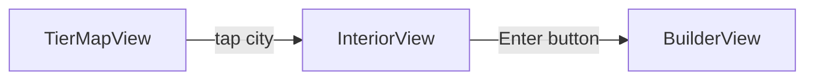

# Interior Screen - Comprehensive Implementation Plan

A new "Interior" screen shown when the user taps a city on the TierMap. The screen uses water-level branding (Lake, River, Sea, Ocean, Abyss), displays a swipeable glass card with problem statements and time limit, background images from Interior_assets, and a gradient blue Enter button that navigates to the Builder.

---

## Navigation Flow



**Change**: [TierMapView.swift](Views/TierMap/TierMapView.swift) currently navigates directly to `BuilderView(tierID:)`. Update to navigate to `InteriorView(tierID:)` instead. `InteriorView` will then push `BuilderView` when Enter is tapped.

---

## 1. Water-Level Mapping (5 Tiers → 5 Levels)

| Tier | City          | Level |
|------|---------------|-------|
| 1    | Tokyo         | Lake  |
| 2    | London        | River |
| 3    | Singapore     | Sea   |
| 4    | New York      | Ocean |
| 5    | San Francisco | Abyss |

Add constants (e.g. in `TierMapConstants` or new `InteriorConstants`):

```swift
static let interiorLevels: [Int: String] = [
    1: "Lake", 2: "River", 3: "Sea", 4: "Ocean", 5: "Abyss"
]
```

---

## 2. Screen Layout (Visual Structure)

```
┌─────────────────────────────────────────┐
│              Interior - Lake            │  ← Title, center top
│                                         │
│  ┌─────────────────────────────────┐   │
│  │   [Background: interior_lake]     │   │
│  │                                  │   │
│  │   ┌──────────────────────────┐   │   │
│  │   │   GLASS CARD              │   │   │
│  │   │   • Problem title         │   │   │
│  │   │   • Problem description  │   │   │
│  │   │   • Keywords (tags)       │   │   │
│  │   │   • Time: [◀] 5 min [▶]   │   │   │
│  │   │   • Swipe indicator       │   │   │
│  │   └──────────────────────────┘   │   │
│  │                                  │   │
│  │   ┌──────────────────────────┐   │   │
│  │   │   Enter  (gradient blue)  │   │   │
│  │   └──────────────────────────┘   │   │
│  └─────────────────────────────────┘   │
└─────────────────────────────────────────┘
```

---

## 3. Background Images - Interior_assets

**Folder structure** (user will provide images):

```
aether.swiftpm/
├── Interior_assets/
│   ├── interior_lake.png      (Tier 1 - Tokyo)
│   ├── interior_river.png    (Tier 2 - London)
│   ├── interior_sea.png      (Tier 3 - Singapore)
│   ├── interior_ocean.png    (Tier 4 - New York)
│   └── interior_abyss.png    (Tier 5 - San Francisco)
```

**Integration**:
- Add `Interior_assets` to the Xcode/SwiftPM target as an asset catalog or resource bundle so images are bundled.
- Use `Image("interior_lake")` (or Asset Catalog names) with `.resizable().aspectRatio(contentMode: .fill)` and `GeometryReader` for full-screen background.
- Fallback: If an image is missing, use a solid gradient (e.g. dark blue → teal) keyed by level.

---

## 4. Title - Center Top

- Text: `"Interior - [Level]"` (e.g. "Interior - Lake").
- Typography: `.system(size: 28, weight: .bold, design: .rounded)` or similar.
- Color: White with subtle shadow for contrast on varied backgrounds.
- Position: `.frame(maxWidth: .infinity)`, `.padding(.top, 60)` (safe area).
- Respect safe area insets on notched devices.

---

## 5. Glass Card - Design Spec

**Material**: `.ultraThinMaterial` or `.regularMaterial` with:
- `RoundedRectangle(cornerRadius: 24)`
- `strokeBorder(.white.opacity(0.3), lineWidth: 1)` for glass edge
- Optional soft shadow for depth
- Padding: ~24pt horizontal, ~20pt vertical

**Content** (top to bottom):

1. **Problem Title** - Bold, e.g. "Notes App"
2. **Problem Description** - Body text, 2–4 lines, wrapping
3. **System Design Keywords** - Horizontal row of pill/badge tags, e.g. `MVVM`, `UI → ViewModel → DB`, `Local Persistence`
4. **Time Limit Row**:
   - Label: "Time limit"
   - Value: "5 min" (default)
   - Stepper: `[−] 5 min [+]` - on-screen arrow-style buttons (not literal keyboard arrows)
   - Range: 3–15 minutes (or 1–20, configurable)
   - Use `.focusable()` if you want physical keyboard arrow support
5. **Swipe Hint** - "Swipe for more problems" or pagination dots (1 of 3, 2 of 3, 3 of 3)

**Swipe behavior**: `TabView` with `.tabViewStyle(.page(indexDisplayMode: .automatic))` or custom `DragGesture` + `@State currentProblemIndex`. Cycle through 3 problems per tier.

---

## 6. Problem Statement Data Model

Create `Data/InteriorContent.swift` (or extend existing tier content):

```swift
struct InteriorProblem: Identifiable {
    let id: String
    let title: String           // "Notes App"
    let description: String    // Full problem text
    let keywords: [String]      // ["MVVM", "UI → ViewModel → DB", ...]
}

// 3 problems per tier, keyed by tierID
static func problems(for tierID: Int) -> [InteriorProblem] { ... }
```

Source content from `plan.md` (lines 39–102) for all 15 problems (3 per tier).

---

## 7. Time Limit Selector

- Default: 5 minutes
- Storage: `@State private var timeLimitMinutes = 5` (passed to Builder later via init or environment)
- UI: Horizontal row with decrement `[-]`, value `"5 min"`, increment `[+]`
- Increments: 1 minute steps
- Range: 3–15 minutes (configurable constant)
- Optional: `.focusable()` + `.onKeyPress` for keyboard arrow support on iPad
- Haptics: `HapticManager.selection()` on change

---

## 8. Gradient Blue Enter Button

- Placed below the glass card with spacing (~24pt)
- Fill: `LinearGradient` blue, e.g. `Color(red: 0.2, green: 0.5, blue: 0.9)` → `Color(red: 0.1, green: 0.4, blue: 0.85)`
- Shape: `RoundedRectangle(cornerRadius: 16)`
- Text: "Enter" (or "Start Building")
- Typography: Semibold, white
- Size: Full width minus horizontal padding, height ~56pt
- Action: Navigate to `BuilderView(tierID: tierID, selectedProblemIndex: currentProblemIndex, timeLimitMinutes: timeLimitMinutes)`
- Haptic: `HapticManager.mediumImpact()` on tap

---

## 9. File Structure

| File | Purpose |
|------|---------|
| `Views/Interior/InteriorView.swift` | Main screen; layout, glass card, Enter |
| `Views/Interior/InteriorGlassCard.swift` | Reusable glass card with problem, keywords, time stepper |
| `Data/InteriorContent.swift` | Problem definitions + keywords per tier |
| `Interior_assets/` | Background images (user-provided) |
| `Utilities/Design/InteriorConstants.swift` | Levels map, time range, layout constants |

---

## 10. BuilderView Updates

- Extend `BuilderView` init to accept:
  - `tierID: Int` (existing)
  - `selectedProblemIndex: Int` (0–2)
  - `timeLimitMinutes: Int` (for future timer)
- Use `selectedProblemIndex` to load the correct problem when implementing the canvas flow.

---

## 11. Accessibility

- VoiceOver labels for card content, time stepper, Enter
- Minimum 44×44pt tap targets for stepper and Enter
- `@ScaledMetric` for readable text

---

## 12. Dark Mode

- Interior screen can ignore app dark mode (background images define look) or apply a light overlay when `isDarkMode` is true for contrast. Decide based on final assets.

---

## Implementation Order

1. Create `InteriorContent.swift` with all 15 problems
2. Add `InteriorConstants.swift` (levels, time range)
3. Create `InteriorView.swift` skeleton with background, title, placeholder card
4. Add `Interior_assets/` and wire images (with gradient fallback)
5. Implement `InteriorGlassCard.swift` with swipe, keywords, time stepper
6. Implement Enter button and navigation to `BuilderView`
7. Update `TierMapView` to push `InteriorView` instead of `BuilderView`
8. Extend `BuilderView` init for problem index and time limit
9. Polish: haptics, accessibility, glass styling
