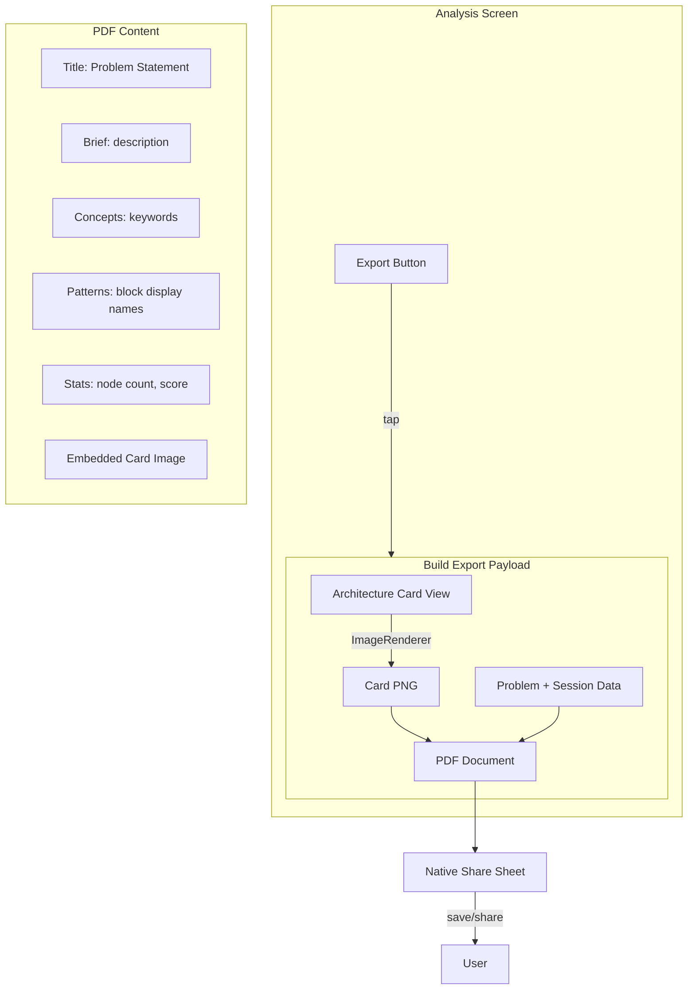

# Analysis Export Feature Plan

## Context

**[AnalysisView](Views/Builder/AnalysisView.swift)** is shown after completing the block-ordering quiz. It receives:
- `session: QuizSession` — includes `problem: InteriorProblem`, `scorePercent`, `totalCorrect/totalQuestions`, `passed`
- `analysisTexts` — AI-generated per-question explanations (not exported per requirements)
- `tierName` — city name (e.g. Tokyo)

**[InteriorProblem](Data/InteriorContent.swift)** has: `id`, `title`, `description`, `keywords` (concepts), `blocks: [NodeType]`. Each problem has 4–6 blocks forming the architecture pattern.

**[NodeType](Models/NodeType.swift)** has `displayName` (e.g. "UI Layer", "ViewModel", "Repository"). The sequence of block display names forms the "pattern name" (e.g. "UI Layer → ViewModel → Repository → API Client").

---

## Export Requirements Summary

| Aspect        | Requirement                                |
| ------------- | ------------------------------------------ |
| Location      | Analysis screen (AnalysisView)             |
| Excluded      | Questions and answers                      |
| Card content  | Node count, pattern name, evaluation score |
| Card style    | Beautiful, social-ready, ImageRenderer     |
| Export format | PDF only                                   |
| PDF title     | Problem statement title                    |
| PDF body      | Problem brief, concepts, patterns, stats   |
| Share UX      | Apple native share sheet                   |
| Filename      | `{problem_title}_arch`                     |

---

## Architecture

---

## Design and UX

### 1. Export Button Placement

- Add an "Export" button in the **done button row** (top-right) of AnalysisView, beside "Done"
- Or: Add a dedicated row below the pass/fail badge with a single prominent "Export Analysis" / "Share" button
- Use SF Symbol: `square.and.arrow.up` for export/share
- Ensure 44pt min touch target; same styling as Done (capsule, white opacity)

### 2. Architecture Card (ImageRenderer)

**Purpose:** Social-ready card image for sharing and PDF embedding.

**Content:**
- **Header:** Problem title (e.g. "Notes App")
- **Subtitle:** Tier/city (e.g. "Tokyo — Local Data Village")
- **Stats row:** 
  - Node count (e.g. "4 Nodes")
  - Pattern name: block display names joined by arrow (e.g. "UI Layer → ViewModel → Repository → Database")
  - Evaluation score: quiz score percentage (e.g. "92%")
- **Visual:** Minimal representation of the architecture (block icons or a simple diagram, no question/answer text)
- **Footer:** "City Architect" or app branding

**Layout and styling:**
- Fixed aspect ratio (e.g. 4:3 or 3:4 for vertical share)
- Dark theme to match app; gradients or material backgrounds
- SF Symbols for block icons; Typography from existing design system
- Rounded corners, subtle shadow for card look
- Suitable for both standalone image and PDF embed

**Technical:** Dedicated SwiftUI view for the card; render via `ImageRenderer` to get `UIImage` for PDF and optional PNG.

### 3. PDF Document Structure

**Page 1:**
- **Title:** Problem statement title (e.g. "Notes App")
- **Problem brief:** `InteriorProblem.description` (1–2 paragraphs)
- **Concepts covered:** `InteriorProblem.keywords` as a list (e.g. "MVVM", "UI → ViewModel → DB", "Local Persistence")
- **Architecture pattern:** Block display names in order (e.g. "UI Layer → ViewModel → Repository → Database")
- **Stats:** Node count, evaluation score (quiz %)
- **Architecture card image:** Full-width card from ImageRenderer

**Formatting:**
- Clear hierarchy: title → brief → concepts → pattern → stats → card
- System fonts (SF Pro); consistent spacing
- Page size suitable for iPad (e.g. A4 or US Letter)

### 4. Filename

- Format: `{problem_title}_arch`
- Sanitize title: replace spaces with underscores or hyphens, remove special characters
- Example: "Notes App" → `Notes_App_arch.pdf`

### 5. Share Sheet

- Use `UIActivityViewController` with the PDF file as the activity item
- Present as a sheet on iPad
- Alternatively use `ShareLink` if targeting iOS 16+ only
- Allow Save to Files, AirDrop, Messages, etc.
- No questions/answers in the exported content

---

## Data Flow

1. User taps Export on AnalysisView
2. Build payload:
   - Problem: `session.problem`
   - Score: `session.scorePercent`
   - Node count: `session.problem.blocks.count`
   - Pattern name: `session.problem.blocks.map(\.displayName).joined(separator: " → ")`
   - Tier/city: `tierName`
3. Render architecture card view with ImageRenderer
4. Create PDF with: title, brief, concepts, pattern, stats, card image
5. Write PDF to temp file with sanitized filename
6. Present share sheet with PDF URL

---

## File and Component Structure

**New files:**
- **ArchitectureExportCardView** — SwiftUI view for the shareable card (stats, pattern, score)
- **ArchitectureExportService** (or similar) — builds PDF from card image + problem data
- **Export logic** — helper to sanitize filename, create temp PDF, present share sheet

**Modified files:**
- **[AnalysisView](Views/Builder/AnalysisView.swift)** — add Export button, call export logic with `session`, `tierName`

---

## Edge Cases and Considerations

1. **Score display:** Use quiz score as "evaluation score" (no separate evaluation engine in current flow)
2. **Long pattern names:** Truncate or wrap in card if needed; keep full pattern in PDF body
3. **Empty state:** Export always available after analysis (we have problem + session)
4. **Orientation:** Card designed for portrait share; PDF follows same orientation
5. **Accessibility:** Export button has clear label and hint; exported PDF is readable by assistive tech
6. **Localization:** Titles and labels could be localized later; initial version in English

---

## Implementation Order

1. Create ArchitectureExportCardView (stats, pattern, score, tier)
2. Add ImageRenderer flow to produce card image
3. Implement PDF generation (title, brief, concepts, pattern, stats, embedded card)
4. Add filename sanitization and temp file handling
5. Integrate share sheet (UIActivityViewController or ShareLink)
6. Add Export button to AnalysisView and wire up export flow

---

## Out of Scope (Explicitly Excluded)

- Export of questions and answers
- Additional formats (PNG-only, etc.) — PDF is the sole export format
- Cloud or automatic sharing
- Edit or annotate before export
