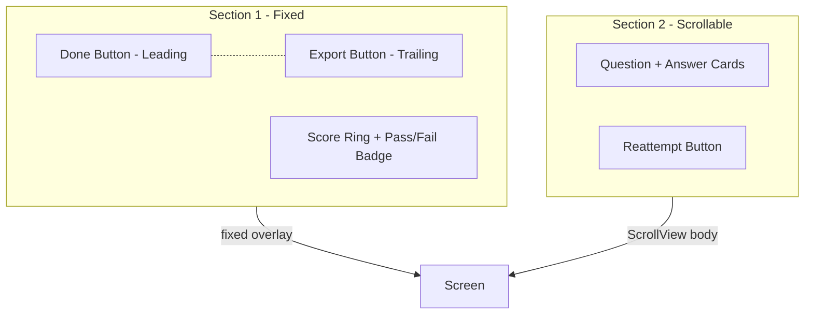

# Analysis Screen Redesign Plan

## Current State

**[AnalysisView](Views/Builder/AnalysisView.swift)** is a full-screen analysis shown after completing all block quizzes. It currently:
- Uses a single ScrollView for all content (buttons, score, pass/fail badge, question breakdown, reattempt)
- Has drowning water overlay (fail) or success glow (pass)
- Uses `Color(red: 0.09, green: 0.09, blue: 0.12)` for background
- Result cards use `.fill(.white.opacity(0.05))` with green/red stroke
- Done and Export buttons are both in the top-right (Spacer + Export + Done)

## Target Layout



**Section 1 (fixed, does not scroll):**
- **Top row:** Done button (leading/top-left), Export button (trailing/top-right) — opposite corners
- **Below:** Score ring (circular %, correct/total), problem title, pass/fail badge
- Section 1 ends; content does not move when user scrolls

**Section 2 (scrollable):**
- All question/answer cards (one per quiz result)
- Reattempt button at the bottom
- Uses the same card background as [QuestionOfTheDayCard](Views/Home/QuestionOfTheDayCard.swift) (`glossyBackground`)

**Background:** Black (`Color.black` or `Color(red: 0, green: 0, blue: 0)`)

---

## Design Specs

### Section 1 Structure

| Element | Position | Notes |
|---------|----------|-------|
| Done button | Top-leading, fixed | Capsule style, same as current |
| Export button | Top-trailing, fixed | Capsule style, same as current |
| Score ring | Below buttons, centered | 160pt circle, gradient stroke |
| Problem title | Below score ring | 18pt semibold |
| Pass/fail badge | Below title | Capsule, green (pass) / blue (fail) |

**Layout:** `VStack` with `.frame(maxWidth: .infinity)` inside an overlay or top-aligned container that does not scroll. Use `safeAreaInsets.top` for top padding.

### Section 2 Structure

| Element | Notes |
|---------|-------|
| Question cards | Reuse `glossyBackground` — black base, white sheen gradient, subtle stroke (see [QuestionOfTheDayCard lines 186–226](Views/Home/QuestionOfTheDayCard.swift)) |
| Reattempt button | Full-width at bottom of ScrollView |

**Card content (per result):**
- Question text + block icon + correct/incorrect indicator
- Your answer (if wrong)
- Correct answer
- AI analysis text

**Card styling:** Replace current `.fill(.white.opacity(0.05))` with `glossyBackground` (extract or duplicate the ZStack from QuestionOfTheDayCard). Corner radius 14, consistent with daily challenge.

### Background

- Screen: `Color.black.ignoresSafeArea()`
- Drowning water and success glow: Remove or keep minimal per design choice — plan assumes clean black for the redesign. If desired, glow/water can be retained as a subtle overlay.

---

## Implementation Approach

### 1. Extract `glossyBackground` for reuse

Add a shared modifier or view so both QuestionOfTheDayCard and AnalysisView use the same style:
- **Option A:** Add `View+GlossyBackground.swift` with a `glossyCardBackground` modifier using `@Environment(\.colorScheme)`.
- **Option B:** Duplicate the `glossyBackground` ZStack in AnalysisView (simpler, no new file).

Recommend Option A for consistency.

### 2. Restructure AnalysisView body

```
ZStack {
    Color.black.ignoresSafeArea()

    VStack(spacing: 0) {
        // Section 1: Fixed
        section1Content
            .padding(.horizontal, 24)

        // Section 2: Scrollable
        ScrollView(.vertical, showsIndicators: false) {
            VStack(alignment: .leading, spacing: 12) {
                ForEach(results) { resultCard(...) }
                reattemptButton
            }
            .padding(.horizontal, 24)
            .padding(.bottom, 48)
        }
    }
}
```

### 3. Section 1 content layout

- `HStack`: `Button("Done")` (leading) | `Spacer()` | `Button("Export")` (trailing)
- `VStack`: scoreSection, problem title, passFailBadge
- Use fixed padding (e.g. `.padding(.top, 60)`) for the top row; ensure metrics do not scroll.

### 4. Result card → glossy style

- Replace `resultCard` background from `.fill(.white.opacity(0.05))` + stroke to `.background { glossyBackground }`
- Keep green/red stroke overlay for correct/incorrect if desired; glossy uses gradient stroke — can overlay colored tint.

---

## File Changes

| File | Change |
|------|--------|
| [AnalysisView.swift](Views/Builder/AnalysisView.swift) | Restructure into Section 1 (fixed) + Section 2 (scroll); black background; Done leading, Export trailing; result cards use glossy background |
| [QuestionOfTheDayCard.swift](Views/Home/QuestionOfTheDayCard.swift) | If Option A: Refactor to use shared `glossyBackground` modifier |
| **New (if Option A):** `Utilities/Design/GlossyCardBackground.swift` | Shared `glossyBackground` view/modifier for cards |

---

## Accessibility

- Preserve existing `accessibilityLabel` / `accessibilityHint` on Done, Export, Reattempt.
- Ensure fixed header does not block scroll; ScrollView content has sufficient top padding below Section 1.

---

## Out of Scope

- Drowning / success effects: Can be removed for a clean black look or kept as a subtle overlay; specify in implementation.
- No changes to QuizResult, analysisTexts, or export flow.
