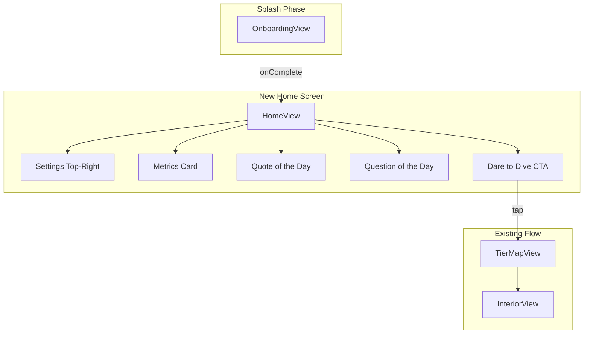

# Home Screen Design Plan

## Context

**Current flow:** Splash (OnboardingView) → MainContentView → TierMapView (cities)  
**Target flow:** Splash → **Home Screen** → TierMapView (when user taps "Dare to Dive")

Relevant files:
- [ContentView.swift](ContentView.swift) — controls `showOnboarding` and shows `MainContentView`
- [MainContentView](ContentView.swift) — wraps `TierMapView` in NavigationStack, hydrates `TierStatsCache`
- [TierMapView.swift](Views/TierMap/TierMapView.swift) — cities map, StatsCardView overlay, Settings button
- [StatsCardView.swift](Views/TierMap/StatsCardView.swift) — metrics card (Passed, Attempts, Best Today)
- [AIQuizService.swift](Services/AIQuizService.swift) — existing Foundation Models usage pattern
- [ColorSystem.swift](Utilities/Design/ColorSystem.swift) — current semantic colors (aetherBackground, aetherSurface, etc.)

---

## Navigation Architecture

- **MainContentView** becomes the container that shows either HomeView or TierMapView based on state (e.g. `hasEnteredCities: Bool` or `currentRoot: .home | .cities`).
- Home Screen includes a prominent "Dare to Dive" CTA; tapping it navigates to TierMapView (push or replace root).
- Back from cities returns to Home (or stays on cities until app restart—design choice: recommend returning to Home on back from empty stack).

---

## Screen Layout (Non-Scrollable)

Single viewport, no ScrollView. Use `GeometryReader` + `Spacer` / fixed spacing to distribute content vertically. Target: iPad primary, iPhone secondary.

**Vertical order (top to bottom):**
1. **Top bar** — Spacer + Settings (gear) top-trailing
2. **Metrics card** — Reuse [StatsCardView](Views/TierMap/StatsCardView.swift), centered or full-width with padding
3. **Quote of the Day** — Compact card
4. **Question of the Day** — Larger card for question + answer reveal
5. **Dare to Dive CTA** — Bottom card/button

**Spacing:** Use consistent vertical rhythm (e.g. 16pt, 24pt, 32pt). Reduce gaps if content overflows on smaller iPads; avoid ScrollView.

---

## Design Standards

### Aesthetic
- **No "vibecode" look:** Avoid generic gradients, purple-on-black, Inter font, rounded-everything.
- **Professional and standard:** Clear hierarchy, readable type, subtle depth. Follow Apple HIG for layout and touch targets.
- **Color palette:** Extend [ColorSystem.swift](Utilities/Design/ColorSystem.swift) with semantic tokens for Home Screen. Do not introduce arbitrary hex values without semantic meaning.

### Color Palette (Extend ColorSystem)

| Token | Dark Mode | Light Mode | Use |
|-------|-----------|------------|-----|
| `homeBackground` | Near-black (0.06) | Near-white (0.98) | Screen background |
| `homeSurface` | 0.11 | 0.94 | Card backgrounds |
| `homeSurfaceElevated` | 0.17 | 0.88 | Elevated cards (quote, question) |
| `homeAccent` | Blue 0.5–0.6 saturation | Blue 0.6–0.7 saturation | CTA, links, accent elements |
| `homeAccentMuted` | Same hue, 0.3 opacity | Same hue, 0.4 opacity | Secondary accents |
| `homeTextPrimary` | White | Black | Headlines, body |
| `homeTextSecondary` | 0.6 | 0.4 | Labels, supporting text |
| `homeBorder` | 0.22 | 0.78 | Card borders, dividers |

Use `UIColor { traitCollection in }` so colors adapt to `preferredColorScheme` (synced with Settings/app theme).

### Typography
- **Headlines:** System font, semibold/bold, 22–28pt
- **Body:** System font, regular, 15–17pt
- **Labels:** Uppercase optional, 10–12pt, letter-spacing 0.8–1.2
- **No custom fonts** — System (SF Pro) only per project rules

### Layout
- **Cards:** Rounded corners 16–20pt, subtle border, light shadow
- **Touch targets:** Minimum 44pt
- **Padding:** 20–24pt horizontal, 16–24pt vertical between sections

---

## Quote of the Day

**Source:** Apple Foundation Models (same stack as [AIQuizService](Services/AIQuizService.swift)).

**Content:** Short, inspiring quote related to mobile system design, software architecture, or learning. One sentence, attributed or anonymous.

**Persistence:** Store `(quoteText, attribution?, date)` keyed by `Calendar.current.startOfDay(for: Date())`. If stored date matches today, show cached. Else generate new quote, cache, display.

**Design:** Card with quote text, optional subtle icon (e.g. quotation mark), minimal attribution. Avoid carousel if non-scrollable—single quote per day. If multiple quotes preferred, use a compact horizontal pager (e.g. `TabView` with `.page` style) with 1–3 items, but keep height constrained.

---

## Question of the Day

**Source:** Apple Foundation Models.

**Content:** One multiple-choice question per day, topic: mobile system design (iOS architecture, MVVM, repositories, caching, etc.). Same structured output pattern as `GeneratedQuizQuestion` in [AIQuizService](Services/AIQuizService.swift).

**Persistence:** Store `(question, options, correctIndex, explanation, date)` keyed by calendar day. Same logic as quote: if today's question exists, show it; else generate, cache, display.

**Interactions:**
- User taps an option
- Reveal correct/incorrect, show brief explanation
- State persists for the day (e.g. `UserDefaults` or SwiftData) so user sees result on return

**Design:** Card with question text, 4 options as tappable rows, and an explanation area that appears after selection.

---

## Dare to Dive CTA

**Purpose:** Navigate from Home to TierMapView (cities).

**Design:** Prominent card or button at bottom. Clear copy: "Dare to Dive" or similar. Optional subtitle: "Explore the cities". Icon optional (e.g. `building.2` or `map`).

**Behavior:** Tap → push or replace root with TierMapView. Back from TierMapView (when no selected city) returns to Home.

---

## Settings Placement

- **Location:** Top-right corner of Home Screen
- **Implementation:** Same as TierMapView—gear button, `.overlay(alignment: .topTrailing)`, presents `SettingsView` as sheet
- **Data:** Settings (e.g. dark mode) apply globally via `preferredColorScheme`; `TierStatsCache` still hydrated on appear (when returning from cities or on first load after splash)

---

## Dark / Light Mode

- All new colors use `UIColor(dynamicProvider:)` or equivalent SwiftUI `Color` initializer with `ColorScheme` / `UITraitCollection`.
- Respect `@AppStorage("isDarkMode")` and `preferredColorScheme` in ContentView so Home Screen matches app theme.

---

## File and Component Structure

**New files:**
- `Views/Home/HomeView.swift` — Main Home Screen layout
- `Views/Home/QuoteOfTheDayCard.swift` — Quote card
- `Views/Home/QuestionOfTheDayCard.swift` — Question card + options + explanation
- `Views/Home/DareToDiveCard.swift` — CTA
- `Services/DailyContentService.swift` — Quote + Question generation and persistence (Foundation Models, date-keyed cache)

**Modified files:**
- [ContentView.swift](ContentView.swift) — Insert HomeView in flow; MainContentView shows Home or TierMap based on navigation state
- [ColorSystem.swift](Utilities/Design/ColorSystem.swift) — Add Home Screen semantic color tokens

**Reused:**
- [StatsCardView](Views/TierMap/StatsCardView.swift) — No changes
- [SettingsView](Views/Settings/SettingsView.swift) — No changes

---

## Implementation Order

1. Add Home Screen color tokens to ColorSystem
2. Create HomeView with non-scrollable layout (placeholders for cards)
3. Integrate StatsCardView and Settings button
4. Implement DareToDiveCard and wire navigation to TierMapView
5. Create DailyContentService with date-keyed persistence
6. Implement QuoteOfTheDayCard and Foundation Model prompt for quotes
7. Implement QuestionOfTheDayCard and Foundation Model structured output for questions
8. Adjust spacing to avoid overflow (no ScrollView)
9. Verify dark/light mode across all new views

---

## Out of Scope

- Glossary, recipes, or other existing features on Home Screen
- Changing TierMapView or city flow behavior beyond navigation entry point
- Custom fonts or assets beyond SF Symbols
